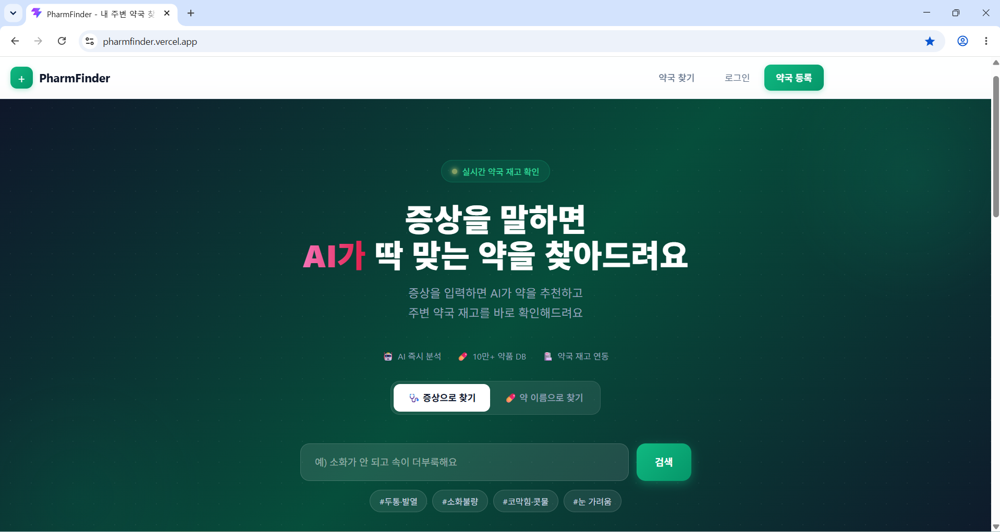

# PharmFinder 💊

> 의약품을 검색하고 근처 약국의 재고를 실시간으로 확인하는 플랫폼



**🌐 Live:** [https://pharmfinder.vercel.app](https://pharmfinder.vercel.app)

---

## 소개

PharmFinder는 사용자가 특정 의약품을 찾을 때 어느 약국에 재고가 있는지 바로 확인할 수 있도록 돕는 서비스입니다.  
AI 증상 분석으로 적합한 약을 추천받고, 지도에서 현재 영업 중인 약국을 찾아 재고 여부까지 한눈에 볼 수 있습니다.

---

## 주요 기능

### 일반 사용자
| 기능 | 설명 |
|------|------|
| 의약품 검색 | 약품명 검색 — DB 우선 조회 후 식약처(MFDS) API 폴백, 결과 캐싱 |
| AI 증상 추천 | 증상을 입력하면 Groq LLaMA-3.3-70b 기반 RAG-lite로 의약품 추천 |
| 약국 지도 | 카카오 로컬 API 기반 실시간 주변 약국 지도, 영업 중/종료 배지 표시 |
| 재고 확인 | 가입 약국의 의약품별 재고 현황 및 품절·부족 배지 |
| 즐겨찾기 | 자주 방문하는 약국 저장·관리 |
| 소셜 로그인 | 카카오·구글·네이버 OAuth 로그인 지원 |

### 약국 관리자 (pharmacy)
| 기능 | 설명 |
|------|------|
| 재고 관리 | 의약품별 재고 추가·수정·삭제 |
| CSV 일괄 업로드 | CSV 파일로 재고 한 번에 등록, 유사 약품명 퍼지 매칭 |
| 공공데이터 연결 | HIRA 공공약국 데이터와 내 약국을 자가 연결 |
| 재고 부족 알림 | 최소 수량 이하 시 Gmail SMTP로 이메일 알림 (일 1회 쿨다운) |
| 약국 정보 수정 | 주소 변경 시 카카오 지오코딩 자동 재적용 |

### 슈퍼 관리자 (admin)
| 기능 | 설명 |
|------|------|
| 약국 승인·거절 | 가입 약국 심사, 거절 사유 입력, 재승인 지원 |
| 회원 관리 | 페이지네이션, 역할 변경, 삭제 |
| 약품 관리 | 의약품 CRUD |
| 통계 대시보드 | KPI 4종 개요 (회원 수·약국 수·약품 수·재고 수) |
| 공공약국 동기화 | HIRA API로 시도/시군구 단위 약국 데이터 수동·자동 동기화 |
| 승인 이메일 알림 | 약국 승인·거절 시 자동 이메일 발송 |

---

## 기술 스택

### 백엔드


| 항목 | 기술 |
|------|------|
| 런타임 | Node.js + Express 5 (CommonJS) |
| 데이터베이스 | Supabase (PostgreSQL) |
| 인증 | JWT (`jsonwebtoken`) + bcryptjs |
| 소셜 로그인 | Passport.js (Google, Kakao, Naver OAuth) |
| AI | Groq SDK (LLaMA-3.3-70b) · Anthropic SDK · Google Generative AI |
| 외부 API | 식약처(MFDS) API · 카카오 로컬 API · HIRA 공공데이터 API |
| 이메일 | Nodemailer (Gmail SMTP) |
| 스케줄러 | node-cron (매일 KST 03:00 공공약국 자동 동기화) |
| 파일 업로드 | Multer |
| 보안 | Helmet · CORS |

### 프론트엔드


| 항목 | 기술 |
|------|------|
| 프레임워크 | React 19 + Vite |
| 스타일링 | TailwindCSS 4 |
| 라우팅 | React Router v7 |
| HTTP 클라이언트 | Axios |
| 차트 | Recharts |
| 분석 | Google Analytics 4 (react-ga4) |

### 인프라
| 항목 | 기술 |
|------|------|
| 백엔드 배포 | Render |
| 프론트엔드 배포 | Vercel |

---

## 아키텍처

```
PharmFinder/
├── backend/
│   └── src/
│       ├── app.js              # Express 앱 (helmet, cors, morgan)
│       ├── server.js           # 서버 진입점 + node-cron 스케줄러
│       ├── config/supabase.js  # Supabase 클라이언트 싱글턴
│       ├── controllers/        # req/res 처리 (try/catch → next(err))
│       ├── services/           # 비즈니스 로직 + Supabase 쿼리
│       ├── routes/             # /api 하위 라우트 통합
│       └── middleware/
│           └── auth.js         # authenticate / authorize / requireApprovedPharmacy
└── frontend/
    └── src/
        ├── App.jsx             # 라우터 + AuthProvider + Layout
        ├── contexts/           # AuthContext (전역 인증 상태)
        ├── components/         # Layout, PrivateRoute 등 공통 컴포넌트
        ├── pages/              # 페이지 컴포넌트
        └── services/api.js     # Axios 인스턴스 (JWT 인터셉터)
```

---

## API 엔드포인트

```
POST   /api/auth/register              일반 회원가입
POST   /api/auth/pharmacy/register     약국 사업자 회원가입
POST   /api/auth/login                 로그인 (JWT 반환)
GET    /api/auth/me                    내 정보 조회
PUT    /api/auth/profile               프로필 수정
PUT    /api/auth/password              비밀번호 변경

GET    /api/auth/kakao                 카카오 OAuth
GET    /api/auth/google                구글 OAuth
GET    /api/auth/naver                 네이버 OAuth

GET    /api/medicines/search?q=        의약품 검색
GET    /api/medicines/:id              의약품 상세
POST   /api/medicines/ai-recommend     AI 증상 기반 추천

GET    /api/pharmacies/public/nearby   주변 공공약국 (카카오 로컬)
GET    /api/pharmacies/:id             가입 약국 상세 + 재고
POST   /api/pharmacies/inventory       재고 등록·수정
POST   /api/pharmacies/inventory/csv   CSV 재고 일괄 업로드

GET    /api/admin/*                    관리자 전용 (admin 역할 필요)
```

---

## 로컬 실행

### 사전 요구사항
- Node.js 20+
- Supabase 프로젝트
- 카카오·구글·네이버 OAuth 앱
- Groq API 키

### 백엔드

```bash
cd backend
cp .env.example .env   # 환경변수 설정
npm install
npm run dev            # http://localhost:3000
```

**`backend/.env` 필수 항목**
```
SUPABASE_URL=
SUPABASE_SERVICE_ROLE_KEY=
JWT_SECRET=
JWT_EXPIRES_IN=7d
PORT=3000
FRONTEND_URL=http://localhost:5173

GROQ_API_KEY=
MFDS_API_KEY=
KAKAO_REST_API_KEY=
HIRA_API_KEY=

KAKAO_CLIENT_ID=
GOOGLE_CLIENT_ID=
GOOGLE_CLIENT_SECRET=
NAVER_CLIENT_ID=
NAVER_CLIENT_SECRET=
SESSION_SECRET=

# 선택 — 이메일 알림
EMAIL_USER=
EMAIL_PASSWORD=
```

### 프론트엔드

```bash
cd frontend
cp .env.example .env   # 환경변수 설정
npm install
npm run dev            # http://localhost:5173
```

**`frontend/.env` 필수 항목**
```
VITE_KAKAO_MAP_APP_KEY=
VITE_API_URL=http://localhost:3000/api
```

---

## 사용자 역할

| 역할 | 설명 |
|------|------|
| `user` | 일반 사용자 — 약 검색, 약국 지도, 즐겨찾기 |
| `pharmacy` | 약국 관리자 — 재고 관리 (관리자 승인 후 활성화) |
| `admin` | 슈퍼 관리자 — 약국 승인, 회원·약품 전체 관리 |

약국 사업자로 가입 시 `pending` 상태로 등록되며, 관리자 승인 후 `approved` 상태로 전환되어 재고 관리 기능이 활성화됩니다.
